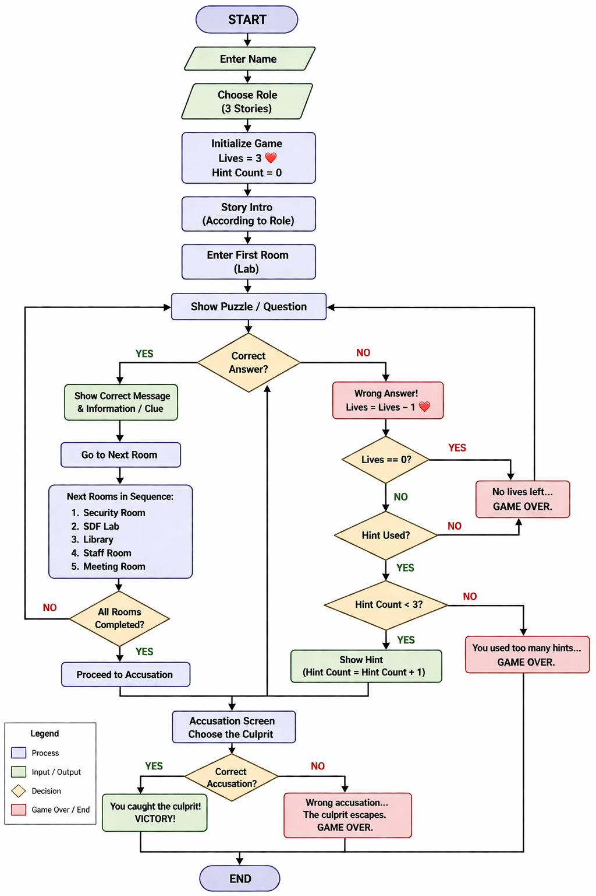

#  Campus Mystery Investigation

A console-based mystery game developed in C++ using Object-Oriented Programming concepts where players solve puzzles, investigate rooms, manage lives, and uncover the culprit.

---

##  Features

- Interactive mystery storylines
- Role selection system
- Different investigation rooms
- Puzzle and quiz-based gameplay
- Lives system 
- Hint system 
- Final accusation mechanism
- Multiple endings

---

##  Concepts Used

- Classes and Objects
- Inheritance
- Polymorphism
- Virtual Functions
- Functions
- Loops
- Conditional Statements
- Dynamic Memory Allocation

---

##  Project Flowchart

---

## Getting Started

1. Enter your name  
2. Choose a role  
3. Explore different rooms  
4. Solve puzzles and quizzes  
5. Manage your lives and use hints  
6. Gather information  
7. Make the final accusation  
8. Solve the mystery 🕵️

---
##  Future Improvements

- GUI using SFML
- Save/Load system
- Score tracking system
- Better graphics
- More stories and puzzles

---

##  Developed By

Kratika Goyal
